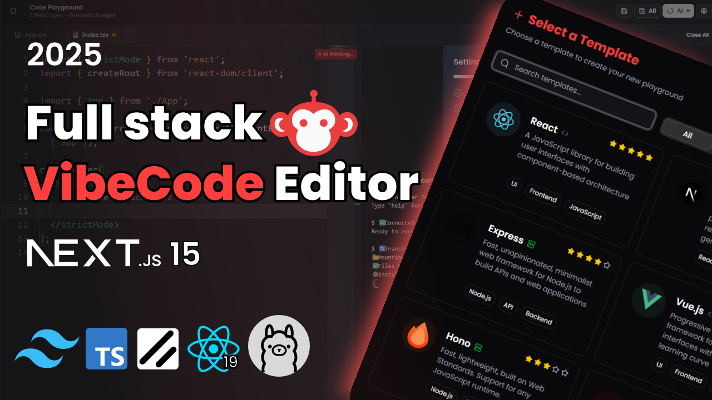
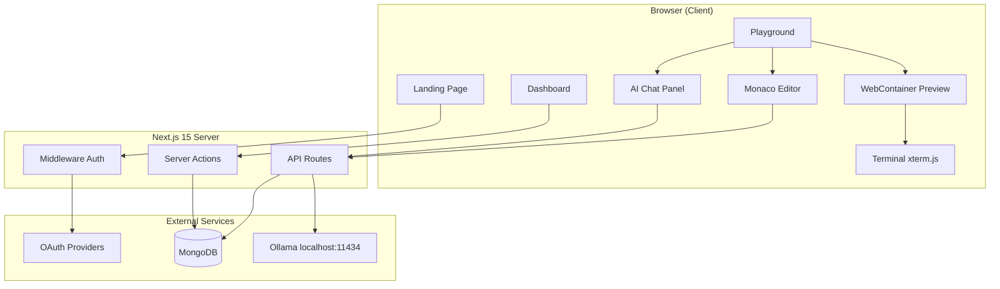

<div align="center">

# VibeCode Editor

### AI-Powered In-Browser IDE

*Write, run, and ship code — directly in your browser.*

<br />



<br />

[](https://nextjs.org/)
[](https://www.typescriptlang.org/)
[](https://tailwindcss.com/)
[](https://www.prisma.io/)
[](https://webcontainers.io/)
[](https://ollama.com/)

<br />

[Features](#-features) ·
[Architecture](#-architecture) ·
[Getting Started](#-getting-started) ·
[Project Structure](#-project-structure) ·
[API Routes](#-api-routes) ·
[Roadmap](#-roadmap)

</div>

---

## Overview

**VibeCode Editor** is a full-stack web IDE that brings the feel of a local dev environment into the browser. Create projects from templates, edit code in Monaco, run apps inside **WebContainers**, talk to a local AI assistant, and persist everything to **MongoDB** — all behind Google/GitHub OAuth.

Think of it as a lightweight cousin to StackBlitz or CodeSandbox, with a built-in AI layer powered by **Ollama** running on your machine.

---

## ✨ Features

### Authentication & User Management
- **OAuth sign-in** via Google and GitHub (NextAuth v5)
- **Protected routes** — dashboard and playground require login
- **JWT sessions** with user role support (`USER`, `PREMIUM_USER`, `ADMIN`)
- Persistent user profiles stored in MongoDB via Prisma

### Dashboard
- **Project hub** — view, search, and manage all your playgrounds
- **Create new projects** from 6 starter templates:
  - React · Next.js · Express · Vue · Hono · Angular
- **Star / bookmark** projects for quick access
- **Edit, duplicate, and delete** projects from a polished table UI
- Sidebar navigation with per-project quick links

### Playground (The Core IDE)
- **Monaco Editor** — the same engine behind VS Code
  - Syntax highlighting for 20+ languages
  - Custom keybindings, formatting, and editor options
  - Multi-tab file editing with unsaved-change indicators
- **File Explorer**
  - Create, rename, and delete files & folders
  - Context-aware dialogs for every operation
  - Tree view with active file highlighting
- **Auto-save to database** — file tree serialized as JSON and stored per playground
- **Resizable split layout** — editor on the left, live preview on the right

### WebContainers Runtime
- **In-browser Node.js** — no server needed to run your code
- Full pipeline: transform files → mount → `npm install` → `npm run start`
- **Live preview iframe** once the dev server is ready
- **Embedded terminal** (xterm.js) streaming install & server logs
- Cross-origin isolation headers configured for WebContainer compatibility

### AI Integration
- **Code completion** — context-aware suggestions via Ollama (`codellama`)
  - Trigger with `Ctrl + Space` or double `Enter`
  - Accept with `Tab`
  - Language & framework detection built into the prompt
- **AI Chat Assistant** — side panel with multiple modes:
  - General chat
  - Code review
  - Bug fixing
  - Performance optimization
- Markdown rendering with GFM, math (KaTeX), and syntax-highlighted code blocks
- Export chat history as JSON

### UI / UX
- **Dark & light mode** with system preference detection
- **ShadCN UI** component library (40+ components)
- **Sonner** toast notifications for every action
- Responsive layouts with collapsible sidebar
- Gradient hero landing page with smooth navigation header

---

## 🏗 Architecture



### How a playground session works

1. **Create** — user picks a template on the dashboard; a `Playground` record is created in MongoDB.
2. **Load** — playground page fetches saved files from DB, or falls back to `/api/template/[id]` which scans the matching folder in `vibecode-starters/`.
3. **Edit** — Monaco renders the active file; changes are tracked in Zustand state (`useFileExplorer`).
4. **Save** — file tree is serialized to JSON and upserted into `TemplateFile` via a server action.
5. **Run** — WebContainer mounts the file tree, installs deps, starts the dev server, and streams output to the terminal.
6. **AI** — editor sends cursor context to `/api/code-completion`; chat panel sends messages to `/api/chat`. Both hit Ollama locally.

---

## 🧱 Tech Stack

| Layer | Technology | Purpose |
|-------|-----------|---------|
| **Framework** | Next.js 15 (App Router) | Routing, SSR, API routes, server actions |
| **Language** | TypeScript 5 | End-to-end type safety |
| **Styling** | Tailwind CSS 4 + ShadCN UI | Design system & components |
| **Auth** | NextAuth v5 (beta) | OAuth + JWT sessions |
| **Database** | MongoDB + Prisma 6 | User, project, and file persistence |
| **Editor** | Monaco Editor | Code editing with IntelliSense |
| **Runtime** | WebContainers API | In-browser Node.js execution |
| **Terminal** | xterm.js + addons | Interactive shell output |
| **AI** | Ollama (CodeLlama) | Local LLM for chat & completions |
| **State** | Zustand | Client-side playground state |
| **Forms** | React Hook Form + Zod | Validated form handling |
| **Notifications** | Sonner | Toast feedback |
| **Theming** | next-themes | Dark / light mode |

---

## 🚀 Getting Started

### Prerequisites

| Tool | Version | Notes |
|------|---------|-------|
| Node.js | 18+ | LTS recommended |
| npm | 9+ | Comes with Node |
| MongoDB | Any | Atlas free tier works |
| Ollama | Latest | For AI features |
| Google / GitHub OAuth | — | For sign-in |

### 1. Clone & install

```bash
git clone <your-repo-url>
cd 35-building-vibe-code-editor
npm install
```

### 2. Environment variables

Copy the example file and fill in your credentials:

```bash
cp .env.example .env.local
```

```env
# Database
DATABASE_URL="mongodb+srv://<user>:<pass>@<cluster>.mongodb.net/vibecode?retryWrites=true&w=majority"

# NextAuth
AUTH_SECRET="generate-with: openssl rand -base64 32"
NEXTAUTH_URL="http://localhost:3000"

# Google OAuth  →  https://console.cloud.google.com/
AUTH_GOOGLE_ID=""
AUTH_GOOGLE_SECRET=""

# GitHub OAuth  →  https://github.com/settings/developers
AUTH_GITHUB_ID=""
AUTH_GITHUB_SECRET=""
```

### 3. Database setup

```bash
npx prisma generate
npx prisma db push
```

This creates the MongoDB collections defined in `prisma/schema.prisma`:
`User`, `Account`, `Playground`, `StarMark`, `TemplateFile`, `ChatMessage`.

### 4. Starter templates

The app expects starter scaffolds inside `vibecode-starters/`:

```
vibecode-starters/
├── react-ts/
├── nextjs-new/
├── express-simple/
├── vue/
├── hono-nodejs-starter/
└── angular/
```

Each folder should be a runnable project with a `package.json`. The template API scans these directories and converts them into a JSON file tree on first load.

> **Note:** If the `vibecode-starters/` folder is empty, new playgrounds won't load any files until you add the starter projects or save code manually.

### 5. Start Ollama

```bash
# Install from https://ollama.com, then:
ollama pull codellama
ollama serve
```

AI features call `http://localhost:11434/api/generate` with the `codellama:latest` model.

### 6. Run the dev server

```bash
npm run dev
```

Open [http://localhost:3000](http://localhost:3000) → sign in → dashboard → create a playground.

---

## 📁 Project Structure

```
├── app/
│   ├── (auth)/auth/sign-in/     # OAuth sign-in page
│   ├── (root)/                  # Landing page
│   ├── dashboard/               # Project management hub
│   ├── playground/[id]/         # Main IDE experience
│   └── api/
│       ├── auth/[...nextauth]/  # NextAuth handlers
│       ├── chat/                # AI chat endpoint
│       ├── code-completion/     # AI suggestion endpoint
│       └── template/[id]/       # Template file-tree generator
│
├── modules/
│   ├── auth/                    # Sign-in, user button, session hooks
│   ├── dashboard/               # Sidebar, project table, templates modal
│   ├── playground/              # Editor, explorer, dialogs, hooks
│   ├── webcontainers/           # Preview, terminal, file transformer
│   ├── ai-chat/                 # Chat side panel component
│   └── home/                    # Header & footer
│
├── components/ui/               # ShadCN primitives (40+ components)
├── lib/                         # DB client, utils, template paths
├── prisma/schema.prisma         # Database schema
├── vibecode-starters/           # Project starter templates
├── auth.ts                      # NextAuth configuration
├── auth.config.ts               # OAuth provider config
├── middleware.ts                 # Route protection
└── routes.ts                    # Public / protected / auth route lists
```

---

## 🔌 API Routes

| Endpoint | Method | Description |
|----------|--------|-------------|
| `/api/auth/[...nextauth]` | GET/POST | NextAuth OAuth flow |
| `/api/template/[id]` | GET | Scans starter template → returns JSON file tree |
| `/api/chat` | POST | Sends message + history to Ollama, returns AI response |
| `/api/code-completion` | POST | Analyzes cursor context, returns code suggestion |

### Chat request example

```json
{
  "message": "How do I add error handling to this fetch call?",
  "history": [
    { "role": "user", "content": "..." },
    { "role": "assistant", "content": "..." }
  ]
}
```

### Code completion request example

```json
{
  "fileContent": "const fetchData = async () => {\n  ",
  "cursorLine": 1,
  "cursorColumn": 2,
  "suggestionType": "inline",
  "fileName": "api.ts"
}
```

---

## ⌨️ Keyboard Shortcuts

| Shortcut | Action |
|----------|--------|
| `Ctrl + S` | Save active file |
| `Ctrl + Space` | Trigger AI code suggestion |
| `Double Enter` | Trigger AI code suggestion |
| `Tab` | Accept AI suggestion |
| `Ctrl + Enter` | Send chat message (in AI panel) |

---

## 🗄 Database Schema (Overview)

```
User
 ├── Account[]          (OAuth linked accounts)
 ├── Playground[]       (owned projects)
 ├── StarMark[]         (bookmarked projects)
 └── ChatMessage[]      (chat history — schema ready)

Playground
 ├── TemplateFile       (serialized file tree as JSON)
 └── StarMark[]

Templates enum: REACT | NEXTJS | EXPRESS | VUE | HONO | ANGULAR
```

---

## 🎨 Design Philosophy

- **Developer-first** — dark zinc palette in the IDE, clean whites on the dashboard
- **Module-based architecture** — each feature domain (`auth`, `dashboard`, `playground`, `webcontainers`, `ai-chat`) is self-contained with its own components, hooks, and actions
- **Server actions over REST** — mutations (create project, save files, toggle star) use Next.js server actions for type-safe, zero-boilerplate data flow
- **Progressive enhancement** — playground works without AI if Ollama isn't running; editor and file management are fully functional on their own

---

## ⚠️ Known Limitations

| Area | Status |
|------|--------|
| Starter templates in `vibecode-starters/` | Must be added manually if folder is empty |
| GitHub repo import | UI placeholder — not yet functional |
| Command palette (`/`) | Planned, not implemented |
| Chat message persistence | DB model exists, not wired to UI yet |
| File context in AI chat | Chat doesn't auto-attach open files |
| Duplicate project | Copies metadata only, not saved files |
| Production build | May require ESLint fixes before `npm run build` passes |
| AI model selector in UI | Cosmetic — API uses `codellama:latest` |

---

## 🗺 Roadmap

- [ ] Ship complete starter templates for all 6 frameworks
- [ ] Wire chat persistence to MongoDB
- [ ] Pass active file context into AI chat
- [ ] Implement GitHub repository import
- [ ] Add command palette (`Cmd/Ctrl + K`)
- [ ] Fix duplicate project to copy `TemplateFile` data
- [ ] Deploy demo to Vercel with setup documentation
- [ ] Add streaming responses for AI chat
- [ ] Support multiple Ollama models from the UI selector

---

## 🛠 Scripts

```bash
npm run dev      # Start dev server (Turbopack)
npm run build    # Production build
npm run start    # Start production server
npm run lint     # ESLint check
```

---

## Project Overview

VibeCode Editor is a web-based code editor project designed to provide a clean and simple coding environment. It helps users write and manage code with an easy-to-use interface.

## Key Features

- Simple and responsive code editor interface
- Clean project structure
- Easy to run locally
- Beginner-friendly setup
- Suitable for learning frontend/editor-based application development

## 🙏 Acknowledgements

Built with and inspired by:

- [Monaco Editor](https://microsoft.github.io/monaco-editor/) — VS Code's editor engine
- [WebContainers](https://webcontainers.io/) — in-browser Node.js by StackBlitz
- [Ollama](https://ollama.com/) — run LLMs locally
- [xterm.js](https://xtermjs.org/) — terminal emulator
- [NextAuth.js](https://next-auth.js.org/) — authentication for Next.js
- [ShadCN UI](https://ui.shadcn.com/) — beautifully designed components

---

<div align="center">

**Built with curiosity and caffeine.**

*If this project helped you, consider giving it a star.*

</div>
